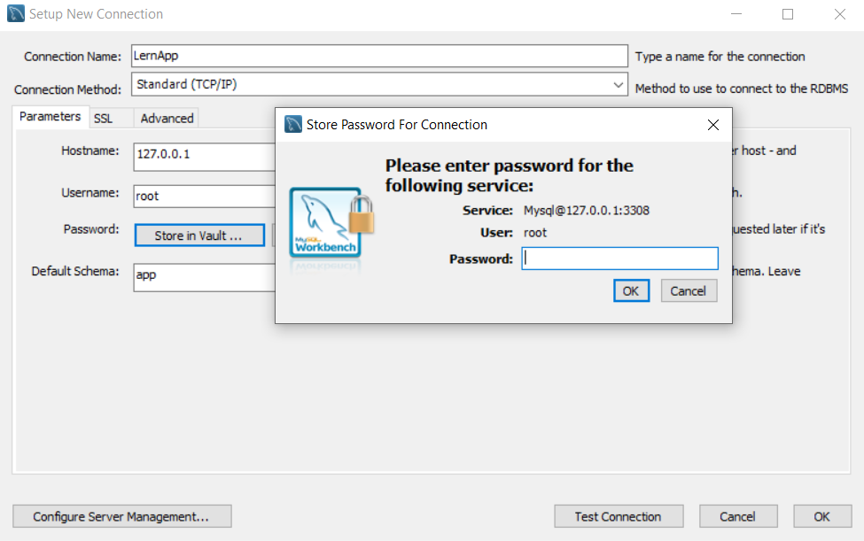

# LernApp

Project for Wintersemester 22/23 Software-Praktikum. Create a LernApp where you can find lernpartners or groups for learning.  
Gruppe 6: Jannik Röhm, Jasmin Krewenka, Paul Ehrlich, Premtim Osmani, Samira Salija, Dimitrios Saltsoelidis, Enes Tepeli

## Requirements

- Install [Docker & Docker Compose](https://www.docker.com/products/docker-desktop/)
- Install [MySQL Workbench](https://www.mysql.com/products/workbench/)
- Install [GitHub Desktop](https://desktop.github.com/) or any other tool of choice

Python Version: 3.10
PyCharm Version: 2022.2.3

## Installation

You can clone the project using GitHub Desktop or any other tool of choice.
You can also clone manually using `git clone git@github.com:LernAppGruppe6/LernApp.git`

### Start development

To start the mysql database & the server you can use

```
docker-compose up -d --build
```

Your application is here:

- Backend: http://localhost:8000/
- Frontend: to be done


### Connect to Database

Database server needs to be up & running (see "Start development").
Connect to database from mySQL workbench: 
Install mySQL workbench (see "Requirements: Install MySQL Workbench)
Click on the "+" like you see in the img.

Fill in the connection name, hostname, port, username and default schema like you see in the img.

Click on the "store in vault" button like you see in the img.

Type "root" for the password.

Click on "ok", then click on "test connection".
Then click on "ok". Your database should be connected and look like this!


## Install new dependencies

Add new dependencies to `backend/Pipfile` and run `docker compose exec backend pipenv install {PACKAGE_NAME}`

e.g. `docker compose exec backend pipenv install mysql-connector-python`

## Troubleshooting

1. `docker-compose down && docker-compose up -d --build --force-recreate`